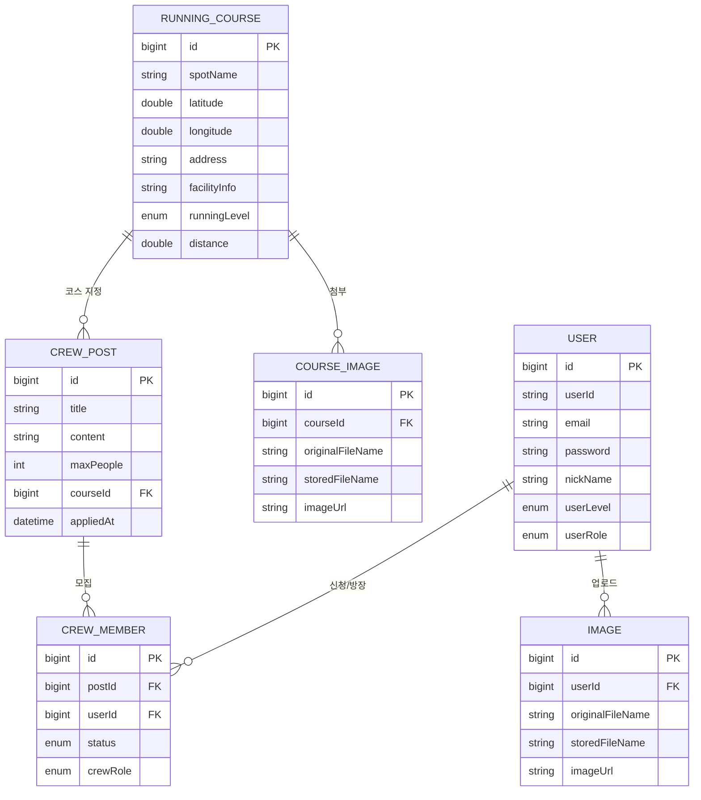

# 🏃 Running Crew

> 공공 데이터 API와 실시간 환경 정보를 결합하여, 단계별 러닝 크루 매칭과 안전한 러닝 코스를 추천하는 웹 대시보드 플랫폼

- **프로젝트 기간** : 2026.06.04 ~ 2026.07.03 (약 4주)
- **팀 구성** : 3인 팀 프로젝트 (Frontend / Backend / Design 역할 분담)
- **Repository** : [axioe/Running_Crew](https://github.com/axioe/Running_Crew)

---

## 목차

1. [프로젝트 소개](#프로젝트-소개)
2. [핵심 기능](#핵심-기능)
3. [기술 스택](#기술-스택)
4. [시스템 아키텍처 (ERD)](#시스템-아키텍처-erd)
5. [팀 구성 및 역할](#팀-구성-및-역할)
6. [담당 업무 (김영현 · 팀장)](#담당-업무-김영현--팀장)
7. [주요 화면 및 API 명세](#주요-화면-및-api-명세)
8. [실행 방법](#실행-방법)

---

## 프로젝트 소개

**Running Crew**는 러너들이 자신의 실력과 목표에 맞는 러닝 크루를 찾고, 공공 데이터를 기반으로 검증된 러닝 코스를 추천받으며, 실시간 날씨·재난 정보로 안전하게 달릴 수 있도록 돕는 서비스입니다.

React 기반 SPA 프론트엔드와 Spring Boot 기반 REST API 백엔드를 분리 개발하고, JWT 기반 무상태(Stateless) 인증 구조로 연동했습니다.

## 핵심 기능

### 1. 메인 대시보드 & 통합 검색
접속 시 사용자의 위치 기반 러닝 정보를 한눈에 보여주는 3단 구성(내 크루 현황 / 추천 크루 모집 / 날씨·재난 위젯) 대시보드와, 장소·지역 통합 검색 및 인기 스팟 퀵 필터 태그를 제공합니다.

### 2. 단계별 러닝 크루 모집 및 매칭
크루 모집글 CRUD, 난이도(상/중/하)·목표 거리 태그 필터링, 참여 신청 → 승인/거절 → 실시간 참가 인원(현재/모집 인원) 카운팅까지 이어지는 매칭 게시판입니다.

### 3. 공공 API 기반 러닝 코스 추천 & 지도 시각화
공공체육시설 정보 API로 확보한 러닝 스팟 데이터를 Kakao Maps API 위에 마커(Pin)로 시각화하고, 마커 클릭 시 해당 장소 기반 크루 모집글로 라우팅됩니다.

### 4. 실시간 날씨 · 재난 안전 위젯
기상청 단기예보 API와 행정안전부 국가재난안전 API를 연동해 지역별 기상 상태와 긴급 재난 상황을 대시보드에 실시간으로 안내합니다.

### 5. 사용자 인증 & 마이페이지
JWT + Spring Security 기반 회원가입/로그인/비밀번호 변경, 내가 신청·활동 중인 크루 현황과 작성한 글을 모아보는 개인화 공간을 제공합니다.

### 6. 관리자(Admin) 페이지
회원 관리, 러닝 크루 모집글 관리, 관리자 계정 관리를 위한 권한 분기(ROLE_ADMIN) 기반 별도 페이지를 제공합니다.

### 7. 이미지 업로드 (AWS S3)
크루/코스 첨부 이미지를 AWS S3에 업로드·다운로드하는 기능을 구현했습니다.

## 기술 스택

| 구분 | 스택 |
|---|---|
| **Frontend** | React 19, React Router DOM 6, Zustand(전역 상태 관리), Axios, React-Bootstrap / Bootstrap 5, Vite |
| **Backend** | Java 17, Spring Boot 3.5, Spring Data JPA, Spring Security, JWT(jjwt) |
| **Database** | MySQL |
| **외부 연동 API** | Kakao Maps API, 기상청 단기예보 API, 행정안전부 국가재난안전 API, 공공체육시설 정보 API |
| **인프라 / 기타** | AWS S3(이미지 저장), AWS EC2 / RDS(배포 인프라), Git/GitHub, Figma |

## 시스템 아키텍처 (ERD)



## 팀 구성 및 역할

| 이름 | 역할 | 담당 업무 |
|---|---|---|
| **김영현 (팀장)** | Frontend 총괄 / 팀 리딩 | 메인 대시보드, 크루 모집, 마이페이지, 로그인/회원가입, 관리자 페이지, 프로젝트 일정 관리 |
| 신오심 | Backend / API 연동 | 모집글·회원·관리자 CRUD API, 공공체육시설·기상청·재난안전 API 연동, 실시간 재난 속보, S3 이미지 업로드 |
| 오미나 | UI/UX 디자인 | CSS·UI/UX 디자인, 프론트엔드 화면 협업(메인/크루/마이페이지) |

## 담당 업무 (김영현 · 팀장)

이 저장소의 커밋 이력 기준, 팀장으로서 아래 영역을 주도적으로 개발했습니다.

- **프로젝트 초기 세팅** : React + Vite 프론트엔드 환경 구축, Spring Boot 백엔드 구조 설계, 프론트-백엔드 연동 기초 작업
- **라우팅/인증 상태 관리** : React Router 기반 SPA 라우팅 설계, Zustand(`useAuthStore`)로 로그인 상태 및 사용자 권한(ROLE) 전역 관리, 관리자 권한 분기 라우팅(`/adminMain`) 구현
- **메인 대시보드** : 통합 검색, 세션 기반 동적 UI(검색 애니메이션 등), 3단 그리드 화면 구성 및 필터링 로직 구현
- **로그인 / 회원가입** : 로그인 폼, 회원가입 폼, 비밀번호 찾기(LoginSearch) 페이지 제작
- **크루 모집 게시판** : 크루 모집창 UI 제작, 모집글 작성/수정 페이지, DB 연동, 난이도 색상 태그 등 UX 개선
- **러닝 코스** : 러닝 코스 장소 추천 화면 및 Kakao Maps 지도 마커 연동
- **마이페이지** : 내 러닝 크루 현황, 비밀번호 변경 기능 구현
- **관리자 페이지** : 관리자 페이지 설계, 세분화된 관리 화면(유저/크루/관리자 계정) 및 경로 설정, 관리자 로그인 시 라우팅 오류 수정
- **실시간 재난 안전 위젯** : 재난 속보 페이지 프론트 제작 및 API 연동 작업
- **버그 픽스 / 리팩터링** : 헤더 단일화, 경로 오류·필터링 오류 등 다수의 화이트박스 테스트 기반 수정

## 주요 화면 및 API 명세

`요구사항정의서`(팀 산출물) 기준 정리한 화면-API 매핑입니다.

| 시스템 | 페이지 | 기능 | Route | 연관 DB Table | Method |
|---|---|---|---|---|---|
| 메인 | 메인 페이지 | 메인 진입 | `/` | - | GET |
| 러닝 코스 | 러닝 코스 페이지 | 코스 목록/상세 | `/course`, `/course-detail/:id` | running_course | GET |
| 크루 모집 | 크루 모집 페이지 | 목록 조회 · 작성 · 수정 · 삭제 | `/crew`, `/crew/write`, `/crew/update`, `/crew/delete` | crew_post | GET/POST/DELETE |
| 크루 모집 | 참여 관리 | 신청 · 목록조회 · 승인 · 거절 · 취소 | `/post/applied`, `/member/getList`, `/member/{id}/approve`, `/member/{id}/reject`, `/member/{id}` | crew_member | POST/GET/PATCH/DELETE |
| 재난 안전 | 실시간 재난 속보 | 재난 정보 조회 | `/safety` | - | GET |
| 마이페이지 | 마이 페이지 | 프로필/내 크루 현황/작성글 조회 | `/mypage`, `/mypage/crew` | user, crew_post | GET |
| 로그인 | 로그인/비밀번호 찾기 | 로그인, 비밀번호 확인 | `/login`, `/user/checkUser` | user | GET/POST |
| 회원가입 | 회원가입 | 회원가입 폼 | `/signup` | user | POST |
| 관리자 | 계정/크루 관리 | 회원·모집글·관리자 계정 CRUD | `/admin/user`, `/admin/adminCrew`, `/admin/posts` | user, crew_post | GET/POST/DELETE |

## 실행 방법

```bash
# Backend (Spring Boot)
cd back_end
./gradlew bootRun

# Frontend (React + Vite)
cd front_end
npm install
npm run dev
```

프론트엔드는 기본적으로 `http://localhost:3000` (CORS 허용 Origin 기준)에서 백엔드 API(JWT 인증 필요 구간 포함)와 통신하도록 구성되어 있습니다.

### 배포 (CI/CD)

GitHub Actions를 통해 `main` 브랜치에 push되면 Backend/Frontend Docker 이미지를 빌드해 Docker Hub에 푸시하고, AWS EC2에 SSH로 접속해 `docker compose`로 무중단 배포되는 CI/CD 파이프라인을 구축했습니다.

- **Frontend** : Nginx 컨테이너 (정적 파일 서빙 + `/api` 리버스 프록시)
- **Backend** : Spring Boot 컨테이너
- **Infra** : AWS EC2(애플리케이션 서버), AWS RDS(MySQL), AWS S3(이미지 저장)

> ⚠️ 실제 운영 서버는 개발 기간 중 한시적으로 열어두었으며, 현재는 비용(금전적) 이슈로 서버를 닫아둔 상태입니다. 로컬 환경에서는 위 실행 방법으로 동일하게 구동해 확인할 수 있습니다.
